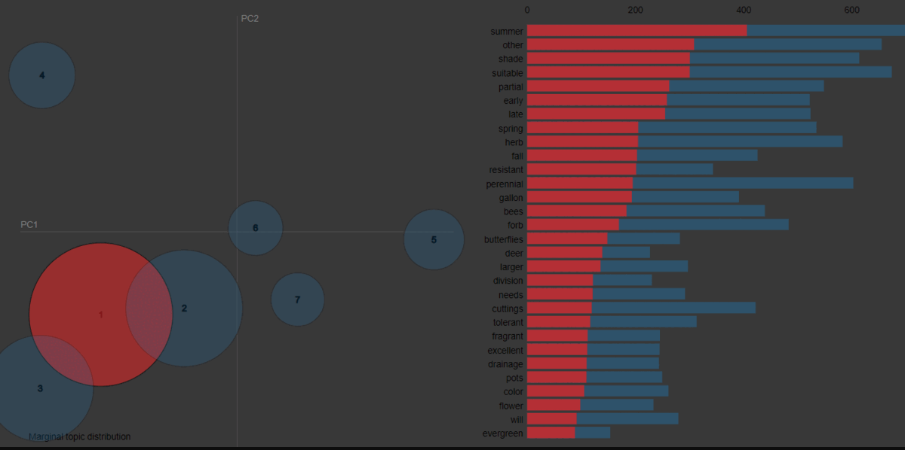

# search_using_topic_model

Flower similarity search using Topic models and probability distance measure.

## Topic Understanding

**Topic 1 :** Trees, attracts deers and butterflies and bees, midly fragrant, Evergreen, non-edibles, Provides shades

**Topic 2 :** Herbs, vegetables, non shady, transplanting types

**Topic 3 :** Wind break Trees and Shrubs, Edible plants, Winter tolerant, Wood cutting types, attracts birds

**Topic 4 :** Sucullents, Cactus, infertile lands, spines, thones, drought tolerant plants/stems 

**Topic 5 :** Helps pollination, fertile land plants, Cultivable plants, Edible plants

**Topic 6 :** Vine types, fertile lands, transplanting types

**Topic 7 :** Moist suitable plants, citrus plants and Aloe

 

dataset used :: https://www.kaggle.com/datasets/ilyaryabov/full-descriptions-of-900-flowers-flower-database

Todo :: config file&#9745;, topic distribution chart&#9745;, gitignore, streamlit gif, mlflow integration

